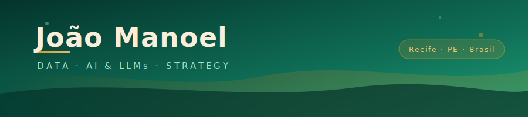

---

### 🇧🇷 Olá! &nbsp;&nbsp;·&nbsp;&nbsp; 🌎 Hello!

---

## 🇧🇷 Sobre mim &nbsp;·&nbsp; 🌎 About me

<table>
<tr>
<td width="50%" valign="top">

📍 Recife, PE — Brasil  
🎓 Administração · IFPE Campus Igarassu  
🤖 Estudo IA em profundidade — LLMs, arquitetura de prompts e automação assistida  
📊 Atuo com dados reais: dashboards, automações e análise em ambiente institucional  
🏗️ Aplico gestão de projetos, arquitetura de processos e programação assistida por IA  

> *Transformo dados em decisões e ideias em soluções — usando IA como alavanca, não como atalho.*

</td>
<td width="50%" valign="top">

📍 Recife, PE — Brazil  
🎓 Business Administration · IFPE Campus Igarassu  
🤖 Studying AI in depth — LLMs, prompt architecture and AI-assisted development  
📊 Working with real data: dashboards, automations and analysis in institutional settings  
🏗️ Applying project management, process architecture and AI-assisted coding  

> *Turning data into decisions and ideas into solutions — using AI as leverage, not a shortcut.*

</td>
</tr>
</table>

---

## 🛠️ Stack

**Data & Analytics**

**AI & LLMs**

**Dev & Tools**

---

## 🧠 O que eu faço &nbsp;·&nbsp; What I do

<table>
<tr>
<td align="center" width="33%">

**🤖 AI & LLMs**

🇧🇷 Estudo IA em profundidade — arquitetura de LLMs, engenharia de prompts e desenvolvimento assistido. Uso IA como ferramenta real de trabalho, não apenas como apoio.

🌎 Studying AI in depth — LLM architecture, prompt engineering and AI-assisted dev. Using AI as a real work tool, not just as support.

</td>
<td align="center" width="33%">

**📊 Data & Automação**

🇧🇷 Construo dashboards, automações e pipelines de dados com Python, SQL e Power BI. Já resolvi problemas reais em ambiente institucional com código assistido por IA.

🌎 Building dashboards, automations and data pipelines with Python, SQL and Power BI. Already solved real institutional problems with AI-assisted code.

</td>
<td align="center" width="33%">

**⚙️ Gestão & Processos**

🇧🇷 Aplico gestão de projetos (Google PM Cert.) e arquitetura de processos com visão estratégica. Atuo na interface entre tecnologia, produto e decisão.

🌎 Applying project management (Google PM Cert.) and process architecture with strategic vision. Working at the intersection of technology, product and decision-making.

</td>
</tr>
</table>

---

## 📦 Projeto em destaque &nbsp;·&nbsp; Featured project

> 🇧🇷 *Projetos indexados em breve — Python, SQL, Power BI e IA.*  
> 🌎 *Indexed projects coming soon — Python, SQL, Power BI and AI.*

### 🗂️ Sistema de Gestão de Atrasos de Acervo — CBIM/IFPE

<table>
<tr>
<td width="60%" valign="top">

**🇧🇷 O que é**  
Ferramenta para automatizar a triagem de empréstimos em atraso durante a migração do sistema Qbiblio → Koha, desenvolvida com IA como assistente de codificação.

**O que faz**
- Extração e estruturação de dados de PDFs via Python
- Cruzamento de 164 atrasos com catálogo de +4.400 tombos
- Priorização de cobranças com base no período acadêmico
- Dashboard com visão geral, lista de alunos, análise do acervo e exportação para Excel

</td>
<td width="40%" valign="top">

**🌎 What it is**  
Tool to automate overdue loan screening during Qbiblio → Koha migration, built with AI as coding assistant.

**Stack**

</td>
</tr>
</table>

---

## 🏅 Certificações &nbsp;·&nbsp; Certifications

---

## 🔥 GitHub Stats

&nbsp;&nbsp;

---

## 📬 Contato &nbsp;·&nbsp; Contact

---

