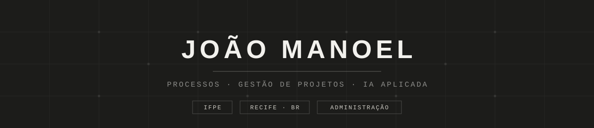

 

### Sobre

**Administração · IFPE Campus Igarassu — Recife, PE**

- Estagiário na Divisão de Pesquisa e Extensão do Instituto Federal de Pernambuco
- Modelagem de processos e projetos independentes e interdependentes para diferentes setores (DPEX - CREE)
- Rotinas administrativas aplicando as óticas da administração

 English

 

**Business Administration · IFPE Campus Igarassu — Recife, PE**

- Intern at the Division of Research and Extension of the Federal Institute of Pernambuco
- Process modeling and independent and interdependent projects for different sectors (DPEX - CREE)
- Administrative routines applying administration perspectives

 

---

### Áreas de atuação

| Área | O que faço | Ferramentas |
|---|---|---|
| **Processos & Modelagem** | Modelagem de processos em BPMN e Bizagi, com foco em fluxos orientados a ramificações e regras de decisão. Miro para os fluxogramas colaborativos. |  ![PyCharm](https://[...]

 English

 

| Area | What I do | Tools |
|---|---|---|
| **Process & Modeling** | Process modeling in BPMN and Bizagi, focused on branch-oriented flows and decision rules. Miro for collaborative flowcharts. | Bizagi · BPMN · Miro |
| **Project Management** | Running projects with Kanban, Scrum and Waterfall — stakeholder mapping and connecting insights to reach defined milestones. Trello for boards, Notion for docs and tra[...]
| **Dev & Applied AI** | AI-assisted development: business-rule-based test creation, basic design systems for MVPs, security and infrastructure fundamentals. Figma for prototyping when the project[...]
| **Data & Analytics** | Dashboards, automations and data pipelines in institutional settings. | Python · Pandas · SQL · Power BI · Excel |
| **General tooling** | Work environment and version control. | Streamlit · PyCharm · Git · GitHub |

 

---

### Projeto em destaque

**Sistema de Gestão de Atrasos de Acervo — CBIM/IFPE**

Ferramenta para automatizar a triagem de empréstimos em atraso durante a migração do sistema Qbiblio → Koha, desenvolvida com IA como assistente de codificação.

- Extração e estruturação de dados de PDFs via Python
- Cruzamento de 164 atrasos com catálogo de +4.400 tombos
- Priorização de cobranças com base no período acadêmico
- Dashboard com visão geral, lista de alunos, análise do acervo e exportação para Excel

 English

 

Tool to automate overdue loan screening during Qbiblio → Koha migration, built with AI as coding assistant.

- Extraction and structuring of data from PDFs via Python
- Cross-referencing 164 overdue loans against a catalog of 4,400+ items
- Collection priority based on academic term
- Dashboard with overview, student list, collection analysis and Excel export

 

---

### Certificações

 

---

### GitHub Stats

 

---

### Contato

 

